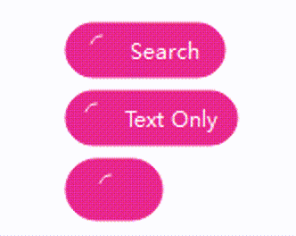
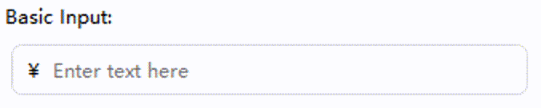
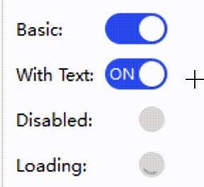

# Qt AntD Widgets

Implement Ant Design style components in Qt Widgets Way, no QML as possible

## Components

Implemented / planned:

- General: Button (implemented), Icon, Typography
- Layout: Divider (implemented), Space, Grid
- Navigation: Breadcrumb, Tabs, Pagination
- Data Entry: Input (implemented), Checkbox, Radio, Switch (implemented), Select, Slider, DatePicker
- Data Display: Badge, Tag, Tooltip, Avatar, Table
- Feedback: Alert, Message, Modal, Progress, Spin
- Other: ConfigProvider, LocaleProvider, Affix

## Theme System

A theme system inspired by Ant Design provides light/dark palettes and semantic colors
(primary, error, etc.). Components can opt-in to theme-driven colors.

See [Theme System](./THEME_SYSTEM.md) for details.

## Build

Requirements:
- Qt 5.15+ or Qt 6.x
- CMake 3.22+
- C++17 compatible compiler

Build in VS Code was recommended, you can reference README in .vscode for detail.


Or you can using CMake:

```powershell
mkdir build
cd build
cmake -DCMAKE_PREFIX_PATH=$env:CMAKE_PREFIX_PATH ..
cmake --build . --config Debug
```

## Button Component


QtAntdButton is an Ant Design styled QPushButton.

Key features:
- Types: Primary, Default, Dashed, Text, Link
- Sizes: Small, Medium, Large
- Shapes: DefaultShape (rounded rect), Round (pill), Circle
- States: block, ghost, danger, loading (with animated spinner)
- Color presets: PresetDefault, PresetPrimary, PresetDanger, PresetPink, PresetPurple, PresetCyan
- Theme-aware colors when useThemeColors() is true (default)


Basic usage:

```cpp
#include <qtantd/qtantdbutton.h>

auto *btn = new QtAntdButton("Primary");
btn->setButtonType(QtAntdButton::Primary);
btn->setButtonSize(QtAntdButton::Medium);
btn->setButtonShape(QtAntdButton::DefaultShape);
btn->setBlock(false);
btn->setGhost(false);
btn->setDanger(false);
btn->setLoading(false);
btn->setColorPreset(QtAntdButton::PresetPrimary);
```

Loading state:

```cpp
btn->setLoading(true); // shows animated spinner and hides icon
```

Circle and round shapes:

```cpp
btn->setButtonShape(QtAntdButton::Round);   // pill
btn->setButtonShape(QtAntdButton::Circle);  // circle, sized by min(width,height)
```

Link/Text style:

```cpp
btn->setButtonType(QtAntdButton::Text);
btn->setButtonType(QtAntdButton::Link);
```

## Input Component




QtAntdInput is an Ant Design styled QLineEdit with custom painting.

Key features:
- Sizes: Small, Medium, Large
- Status: Normal, Error, Warning, Success (affects border and focus ring)
- Clear button (visible when enabled, text is not empty, and not read-only)
- Prefix/Suffix content: text or icon
- Theme-aware background, border, and text colors via theme tokens
- Toggle theme usage with useThemeColors(true/false)

Basic usage:

```cpp
#include <qtantd/qtantdinput.h>

auto *input = new QtAntdInput("Enter text here");
input->setInputSize(QtAntdInput::Medium);
input->setInputStatus(QtAntdInput::Normal);
input->setClearButtonEnabled(true);
```

Sizes and status:

```cpp
input->setInputSize(QtAntdInput::Large);
input->setInputStatus(QtAntdInput::Error);
```

Prefix/Suffix support (text or icon):

```cpp
input->setPrefixText("$");
input->setSuffixText(".com");
// or use icons
input->setPrefixIcon(QIcon::fromTheme("search"));
input->setSuffixIcon(QIcon(":/icons/calendar.svg"));
```

Clear button and signal:

```cpp
input->setClearButtonEnabled(true);
connect(input, &QtAntdInput::clearButtonClicked, [](){
    qDebug() << "Clear button clicked!";
});
```

Theme colors toggle and common states:

```cpp
input->setUseThemeColors(true);   // default; colors come from the theme
input->setUseThemeColors(false);  // fallback to QLineEdit-like colors

input->setDisabled(false);
input->setReadOnly(false);
```

## Switch Component



QtAntdSwitch is an Ant Design styled toggle switch built on QAbstractButton.
It supports animated thumb movement, hover/pressed/focus visuals, optional text or icon inside the track, a loading spinner, and theme-aware colors.

Key features:
- Sizes: Small, Medium (default), Large
- Content per state: checked/unchecked text or icon rendered inside the track
- Loading state: shows a spinner inside the handle and disables interaction
- Theme-aware colors via the theme system (primary, hover, active, border, disabled)
- Keyboard accessible: Space/Enter to toggle, visible focus outline
- Wave/ripple feedback on toggle release (Ant Design wave effect)

Basic usage:

```cpp
#include <qtantd/qtantdswitch.h>

auto *sw = new QtAntdSwitch;         // or QtAntdSwitch("Label")
sw->setChecked(true);                // initial state
sw->setSwitchSize(QtAntdSwitch::Medium);
```

Text or icon per state:

```cpp
sw->setCheckedText("On");
sw->setUncheckedText("Off");
// or use icons
sw->setCheckedIcon(QIcon::fromTheme("check"));
sw->setUncheckedIcon(QIcon::fromTheme("close"));
```

Sizes:

```cpp
sw->setSwitchSize(QtAntdSwitch::Small);
sw->setSwitchSize(QtAntdSwitch::Medium);
sw->setSwitchSize(QtAntdSwitch::Large);
```

Loading and theme colors:

```cpp
sw->setLoading(true);           // shows animated spinner on the handle and disables the switch
sw->setUseThemeColors(true);    // default; colors from QtAntdStyle/Theme
sw->setUseThemeColors(false);   // fallback to basic colors
```

Signals (inherited from QAbstractButton):

```cpp
connect(sw, &QtAntdSwitch::toggled, this, [](bool on){ qDebug() << "Switch:" << on; });
connect(sw, &QtAntdSwitch::clicked, this, [](){ qDebug() << "Clicked"; });
```

Notes:
- Default geometry follows Ant Design: compact rounded track with an animated circular handle.
- Hover/pressed states subtly adjust the track color; a dashed focus ring is drawn when focused.
- When loading, the handle shows a spinner and user interaction is disabled until loading is cleared.
- See the examples app for a Switch settings editor and live demo.

## Examples

See the examples/ folder for a demo application and settings editors.